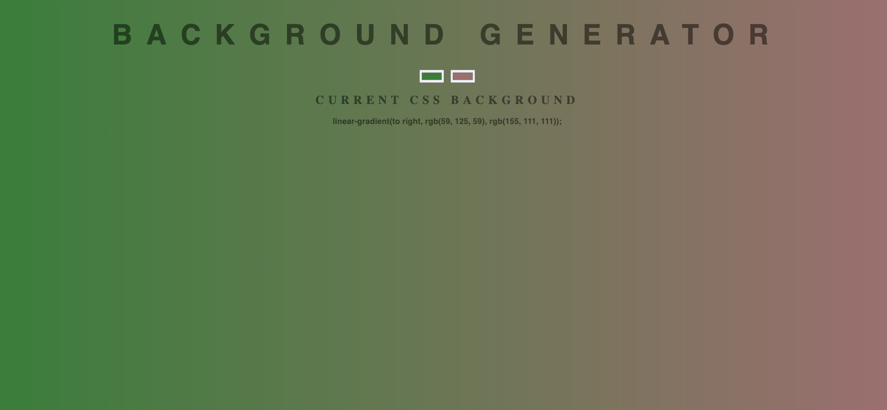

# BackGround Generator 

demo : https://mona95.github.io/Background-Generator/

this is a simple site for generating a linear background (to right ) , you can easily pick two different colors and the css code will appear right below them , all you need to do is copy and paste 

